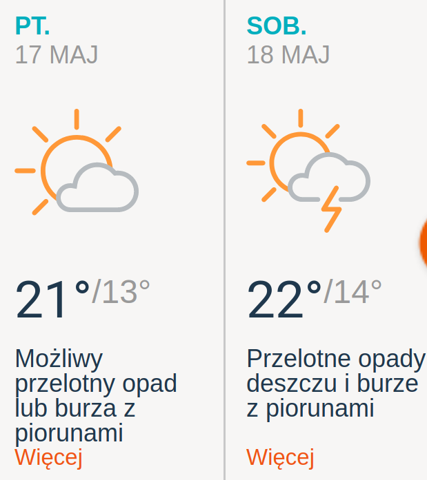
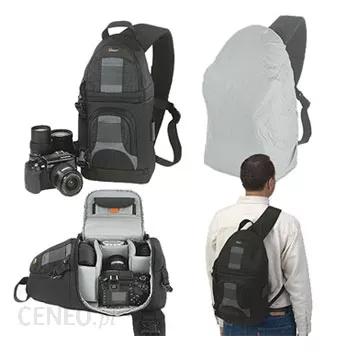
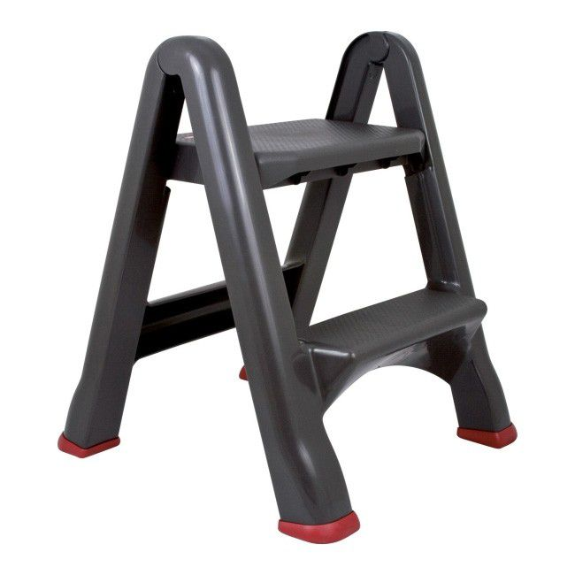
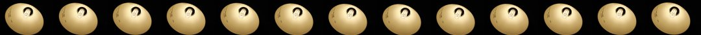
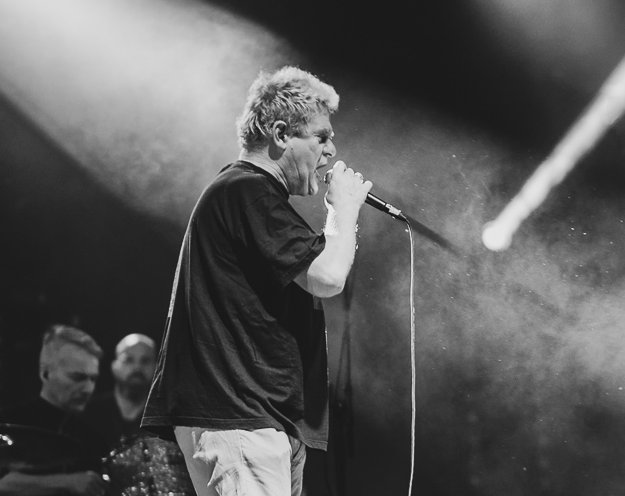
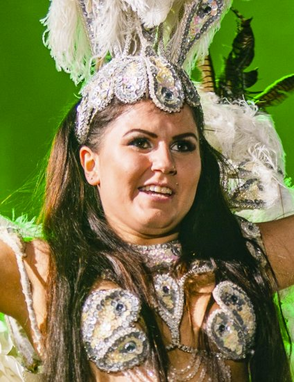
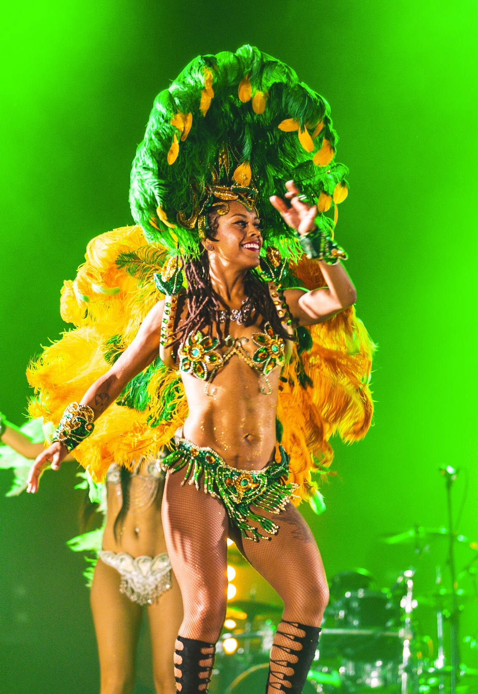
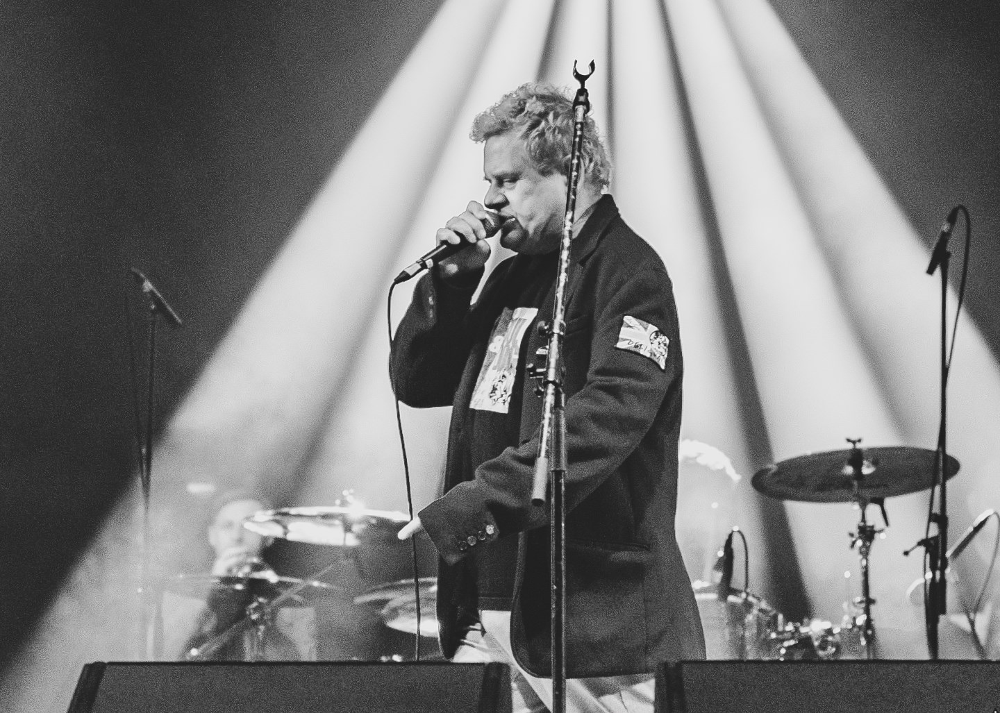
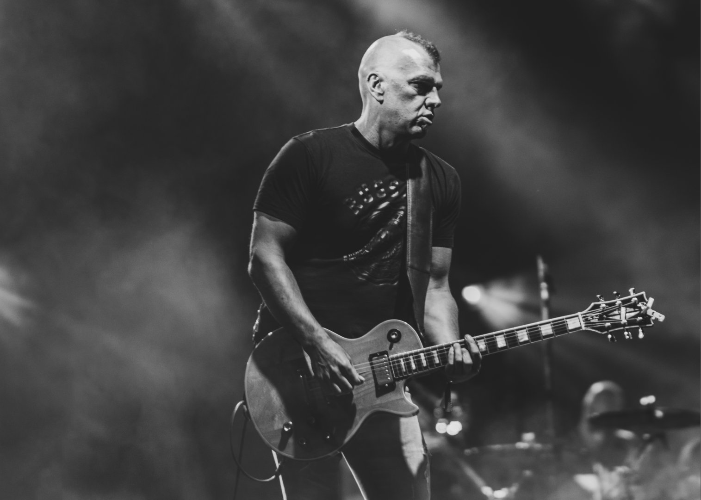
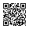

    

<!-- .slide: data-background="./media/001_title2.jpg" data-background-opacity="0.2" -->
# Jak nie robić zdjęć na koncertach

*by* Diodor Sirola

[diodor.sirola@gmail.com](mailto:diodor.si@samsung.com)
---
<!-- .slide: data-background="./media/001_title2.jpg" data-background-opacity="1" -->
---
# O mnie

Fotografuję koncerty na Juwenaliach. Od zawsze.

... i tylko tam ;) <!-- .element: class="fragment" -->

A moja główna dziedzina to akty. <!-- .element: class="fragment" -->
----
(bez cenzury)

[https://diodorsirola.maxmodels.pl](https://diodorsirola.maxmodels.pl)

(wymaga logowania)

[https://35photo.pro/diodorsirola](https://35photo.pro/diodorsirola)
----
# Instagram
### @diodorsirola

---
# Przed koncertem
---
## Sprawdź pogodę
ale i tak przygotuj się na deszcz

(pogoda zapowiada się nieźle!)
----

----

---
## Weź rękawiczki bez palców
jak ma być chłodno.
---
## Weź wielorazowe chemiczne [ogrzewacze dłoni](https://pl.wikipedia.org/wiki/Ogrzewacz_d%C5%82oni)
[Bywają w lidlu po 10 PLN](https://www.youtube.com/watch?v=jUbbyqsrAEM)
---
## Ubierz się ciepło
podwójne skarpety i bluza pod kurtkę nie są głupim pomysłem

Zawsze można się rozebrać ;) <!-- .element: class="dimm" -->
---
## Jeśli masz wadę wzroku
soczewki kontaktowe  mogą być wygodniejsze niż okulary
---
## Znaj swój sprzęt
obsługa i możliwości

Szczegóły później <!-- .element: class="dimm smaller4" -->
---
## Naładuj baterie
zapasowa bateria w plecaku

nie w gripie, bo ciężko! <!-- .element: class="hl3" -->
---
## Zamontuj pasek do aparatu!
---
## Przygotuj **najszybszą** kartę pamięci jaką masz
3 piosenki to mało czasu
---
## Wyczyść obiektywy i matrycę
paprochy nie są sexy
---
## Zabierz wygodny plecak/torbę foto
ja mam [Lowepro SlingShot 200 AW](https://www.cyfrowe.pl/archiwum/aparaty/lowepro-slingshot-200-aw.html) i jest OK
----

---
## Ogranicz ilość sprzętu
może nie być czasu na użycie wszystkich 10 obiektywów ;)
---
# Jaki obiektyw?
---
## Ostry
ze sprawnym i trafiającym AF
---
## Jasny
może być ciemno
---
## Zoom
70-200/2.8 + 28-70/2.8
---
## W praktyce
to, co masz i co ci leży
---
## Moje statystyki
* Juwenalia 2018:
 * 70-200/2.8: 66%
    * 55% powyżej 100mm
    * 13% na max 200mm
 * 85/1.4: 29%
 * 35/1.4: 5%
----
* Studnia 2018:
 * 70-200/2.8: 42%
 * 35/1.4: 25%
 * 85/1.4: 15%
 * 50/1.4: 9%
  * 16-35/2.8: 8%
 * 28/2.8: 1%
----
 * Juwenalia 2014:
   * 70-200/2.8: 95%
   * 28-75/2.8: 5%
---
# Warto zabrać też
(low-budget) <!-- .element: class="dimm" -->
---
## Foliowy płaszcz przeciwdeszczowy
**[3 PLN]** Gdzie?! W kiosku.

---
## Stopery do uszu
**[2 PLN]** W każdej aptece, proś o "stoper woskowy".

---
## 2 średnie mocniejsze worki na śmieci
**[0.20 PLN]**
Nic nie ważą, a jak zacznie padać można szybko schować sprzęt.
---
## Kilka gumek recepturek
czymś te worki trzeba przymocować do aparatu
---
## Schodki składane*
[70 PLN] w [castoramie](https://www.castorama.pl/schodki-skladane-2-stopniowe-pcv-id-1028806.html)

---
# Sprawy organizacyjne
---
## Przyjdź wcześniej.
### Koncert nie zaczeka.
---
### Weź swój "prowiant" (o ile się da...)
---
## Sprawdź jak odebrać identyfikator
### i gdzie masz go **oddać po koncercie**.
---
## Zamelduj się w FocuPunkcie.
### (Więcej info będzie w mailu)
---
# Tuż przed koncertem
---
## Dowiedz się ile masz piosenek
#### najczęściej: 3 albo no-limit
---
## Dowiedz się jak dojść do fosy
#### czyli do miejsca między sceną a barierkami
#### (może w tym roku będzie wejście z prawej?)
---
## Idź do fosy
#### pokazuj opaski/identyfikatory ochronie
najczęściej patrzą tylko na opaski <!-- .element: class="dimm2"-->
---
## Czekaj na początek koncertu
#### możesz robić zdjęcia co ciekawszym  egzemplarzom w tłumie
---
# Zaczyna się koncert!
---
# **Fotografuj!!!**
#### do czasu sygnalizacji przez ochronę, że to już
---
## Opuść fosę.
Nie przeciągaj.
---
**Uwaga!** Czasem nie musisz całkowicie  schodzić spod sceny!
---
## Czatuj z boku sceny
z długim obiektywem.

200 mm jest całkiem OK.
---
## Wróć spod sceny i zgraj foty na backup
o ile będzie taka opcja
---
# Jak fotografować?
---
# Sprawy techniczne
---
## RAW
chyba, że jesteś foto live. Wtedy zgodnie z ustaleniami z twoim edytorem.<!-- .element: class="smaller4"-->
---
## Ustaw zdjęcia serią*
później się wykasuje

\* o ile masz szybką kartę pamięci <!-- .element: class="smaller4"-->
---
## Ustaw _dobry_ tryb AF
* Jeśli ciągły + tracking działa &ndash; dobra opcja
* Jeśli masz dobry AF na LV (detekcja fazy) &ndash; użyj LV
* Jeśli AF to loteria &ndash; ostrz manualnie
  * manualny Focus Bracketing!
* ...
---
## Migawka
Najwolniej 1/250 jeśli chcesz mieć ostre zdjęcia

Stats: 1/250: 32%, 1/320: 49%, 1/500: 18%, 1/800: 1%
----
Chyba, że to koncert Kultu, to 1/40 nawet będzie ok.
Kazik się nie rusza.
---
## Przysłona
Szeroko! Ale żeby nie było mydła.

Czasem opłaca się przymknąć o stopień lub dwa.

Stats: 2.8: 66%, 1.4: 34%
---
## ISO
Jak najniższe, ale nigdy więcej niż używalne.

Stats: 300-800: 76%, 1000-2000: 12%, 2500-32000: 13%
---
## Tryb
Taki, jaki lubisz i umiesz.
----
* Jak jest widno:
  * priorytet przysłony (A),
  * pomiar matrycowy.
----
* Jak jest ciemno:
  * manual (M) 

przy stroboskopach i światłach LED z PWM  tryb auto może zgłupieć <!-- .element: class="smaller4"-->
----
Jeśli Twój aparat obsługuje tryby użytkownika (C1, C2, C3) ustaw:
 * C1 na scenę, AF-C + tracking
 * C2 na scenę, AF-S, tylko punkty krzyżowe
 * C3 na publikę
---
## Preferuj jaśniej niż ciemniej
EV+0.5
----
Jak nie doświetlisz zdjęcia przy ISO 2000, powodzenia przy wyciąganiu cieni.

Delikatne prześwietlenie zazwyczaj da się uratować w obróbce.
---
## Flicker!
----
Uwaga na kiepskie światła z modulacją PWM!

W tym na tanie żarówki LED.
----
Migają z częstotliwością ok 100Hz i mają bardzo małą bezwładność. Przy czasie 1/250 można trafić na ciemność.

----
Przy scenicznych jest jeszcze gorzej. Włączenie funkcji "Anti Flicker" w aparacie może problem jeszcze pogłębić.
----
Przed koncertem (na nie swoim koncercie, z publiczności) zrobić serię zdjęć świateł z czasem naświetlanie 1/300..1/500. Zobaczyć czy różnią się jasnością.
---
# Kompozycja
---
## Zjadanie mikrofonu
----
### Źle

----
### Lepiej

----
### Lepiej

---
## Perspektywa z fosy
żabia perspektywa jest ogólnie niekorzystna dla ludzi
----
#### Mężczyźni: zazwyczaj to nie problem
zazwyczaj i tak są brzydale i nic im nie zaszkodzi :P <!-- .element: class="dimm"-->
----
#### Kobiety: ... :/

----
Schodki trochę pomagają.
Ale trzeba uważnie obserwować sytuację.
----
### Lepiej

---
## Statywy
----
### Źle

----
### Lepiej

----
### Lepiej - retusz

---
# To już prawie wszystko
----
## Teraz zobaczymy moje zdjęcia z Juwenaliów 2018
#### już po odrzuceniu odpadów
---
# 
Dziękuję!

Diodor Sirola

[diodor.sirola@gmail.com](mailto:diodor.si@samsung.com)
---
# Like?

[https://www.facebook.com/diodor.sirola.photography](https://www.facebook.com/diodor.sirola.photography/)

